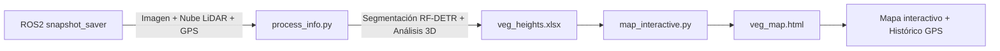

---

# 🌿 LiDAR–Cámara Vegetation Mapping Pipeline

Este proyecto permite **capturar sincronizadamente imágenes RGB y nubes de puntos LiDAR**, segmentar la vegetación mediante visión por computador y **calcular la altura media de la hierba en 3D**, generando un **mapa interactivo** con geolocalización GPS.

---

## 📦 Estructura general del proyecto

```
forest_segmentation/
├── config/                      
│   └── snapshot.yaml            # Archivo de configuración de los parámetros para la captura de datos
│
├── forest_segmentation/
│   ├── map_interactive.py       # Genera mapa interactivo Folium filtrando los resultados
│   ├── net_monitor_node.py      # Monitorización de la cobertura de internet
│   ├── process_individual.py    # Segmenta y calcula alturas de vegetación por tramos, para la última captura
│   ├── process.py               # Segmenta y calcula alturas de vegetación por tramos, para todas las capturas
│   ├── snapshot_client.py       # Cliente ROS2 para la captura de datos
│   └── snapshot_action.py       # Acción ROS2 para la captura de datos
│
├── launch/
│   └── snapshot.launch.py       # Launcher para la captura de datos (action-client)
│ 
├── runs/checkpoint_best_ema.pth # Modelo RF-DETRSegPreview entrenado
│ 
└── snapshots/                   # Contiene los datos capturados y procesados
    ├── 2025-10-23_10-29-12/     # Formato de las carpetas de captura: AAAA-MM-DD_HH-MM-SS/
    │   ├── *_image.png          # Imagen capturada por la cámara
    │   ├── *_points.npy         # Nube de puntos capturada por el LiDAR
    │   ├── *_tf.json            # Transformaciones entre cámara y LiDAR
    │   ├── camera_info.json     # Parámetros intrinsecos de la cámara
    │   └── processed/           # Contiene los archivos procesados: nubes de puntos, csv e imágenes
    │       ├── smallveg_clean.npy
    │       ├── veg_heights.xlsx
    │       └── vari_smallveg.png
    │       └── ...
    └── maps/                    # Contiene lo relativo al mapa interactivo
        ├── veg_points.json      # Histórico de los puntos acumulados
        └── veg_map.html
```

---

## 🚀 Captura de datos

Para capturar un **snapshot sincronizado** con imagen RGB, nube de puntos del LiDAR, coordenadas GPS y transformaciones entre cámara y LiDAR:

```bash
ros2 launch forest_segmentation snapshot.launch.py
```

👉 Esto genera una nueva carpeta en `snapshots/` con el formato `YYYY-MM-DD_HH-MM-SS/`, que contiene todos los datos necesarios para el procesamiento posterior. Captura una única vez.

Para poder ejecutar las capturas en múltiples ocasiones se ha desarrollado un **nodo servidor de acciones** que sincroniza **Imagen + LiDAR + GPS** y guarda un *snapshot* completo a disco, más un ejemplo de un nodo **cliente** que dispara capturas periódicas.

### Nodos

* **`snapshot_action`** (servidor)
  Publica la acción **`/take_snapshot`** del paquete `forest_segmentation_interfaces`. Sincroniza:
  * `sensor_msgs/Image` en `image_topic`
  * `sensor_msgs/PointCloud2` en `lidar_topic`
  * `sensor_msgs/NavSatFix` en `gps_topic`
    y escucha `sensor_msgs/CameraInfo` en `caminfo_topic` (se guarda bajo demanda).  

* **`snapshot_client`** (cliente)
  Envía goals periódicos a `/take_snapshot` con *slop* y la opción de exigir `CameraInfo` **solo en el primer goal**. Evita solapar goals si uno sigue en curso. 

### Interfaz de la acción `TakeSnapshot`

* **Goal**

  * `float32 sync_slop_sec` — tolerancia de sincronización.
  * `bool require_caminfo` — si `true`, intenta guardar `camera_info.json` en ese snapshot.
* **Feedback**

  * `string state` — estados como `"syncing"`, `"saving"`. 
* **Result**

  * `bool success`, `string error`
  * `string output_dir`, `string basename`
  * `string image_path`, `points_path`, `gps_path`, `tf_path` 

### Parámetros

* **Cliente**

  * `period_sec` (float, default 15.0): periodo entre capturas. 
  * `sync_slop_sec` (float, default 0.1): *slop* por defecto para la sincronización. 

### Ejecución Manual (sin launcher)

1. **Servidor**

```bash
ros2 run forest_segmentation snapshot_action --ros-args --params-file snapshot.yaml
```

2. **Cliente** (capturas periódicas)

```bash
ros2 run forest_segmentation snapshot_client \
  --ros-args -p period_sec:=10.0 -p sync_slop_sec:=0.08
```

3. **Goal manual con CLI**

```bash
ros2 action send_goal /take_snapshot \
  forest_segmentation_interfaces/action/TakeSnapshot \
  "{sync_slop_sec: 0.05, require_caminfo: true}"
```

### Estructura de salida

Los snapshots se guardan en `forest_segmentation/snapshots/AAAA-MM-DD_HH-MM-SS/` con prefijo de *timestamp* de la imagen:

```
<fecha>_<hora>_<usec>_image.png
<fecha>_<hora>_<usec>_points.npy
<fecha>_<hora>_<usec>_gps.json
<fecha>_<hora>_<usec>_tf.json
camera_info.json        # si lo solicitaste en el goal
```

### Troubleshooting

* **“Goal en curso”**: el cliente no envía un nuevo goal hasta que termine el anterior. Baja `period_sec` o evita tiempos muertos largos. 
* **Timeout esperando datos sincronizados**: revisa *topics* y sube `sync_slop_sec` si las fuentes no están bien alineadas. 
* **TF no encontrada** (`camera_left←lidar`) : ajusta frames o publica la TF estática correspondiente. 

---

## 🌾 Procesamiento y segmentación

Una vez capturados los datos, ejecuta:

```bash
python3 process.py
```

### 🔍 ¿Qué hace este script (`process.py`)?

1. **Localiza automáticamente** todos los snapshots en `snapshots/` según el nombre de la carpeta.
2. **Carga los datos**:

   * Imagen RGB (`*_image.png`)
   * Nube de puntos (`*_points.npy`)
   * Transformaciones cámara–LiDAR (`*_tf.json`)
   * Parámetros intrínsecos (`camera_info.json`)
3. **Aplica segmentación RF-DETR-SegPreview** para clasificar cada píxel según su clase:

   * `forest` → vegetación alta (bosques)
   * `obstacle` → obstáculos no previstos en el entorno (tendido eléctrico, señales, vehículos...)
   * `rough` → camino pedregoso
   * `sky` → cielo
   * `smallveg` → vegetación baja / media
   * `smooth` → camino o superficie transitable
4. **Fusiona LiDAR + segmentación:**

   * Proyecta los puntos LiDAR sobre la imagen.
   * Asigna etiquetas 3D por clase (vegetación o camino).
   * Filtra outliers (altura y ruido) con `Open3D.remove_statistical_outlier`.
5. **Analiza la vegetación**:

   * Si hay suficientes puntos de camino (se establece un mínimo de 30):
     * Ajusta un **eje central del camino** (polinomio de grado 3).
     * Divide la vegetación en **izquierda / derecha**.
     * Calcula la altura por tramos de 0.1 m (z_max – z_min).
     * Guarda las métricas en `veg_heights.xlsx` (`left`, `right`).

   * Si **no hay camino** (off-road):
     * Analiza toda la vegetación como un solo bloque.
     * Guarda `veg_heights.xlsx` con hoja `all`.
8. **Índice VARI**:

   Calcula VARI (Visible Atmospherically Resistant Index) solo en píxeles `smallveg` y guarda un overlay como `vari_smallveg.png`.
7. **Llama automáticamente** a `map_interactive.py` para actualizar el mapa.

---

## 🗺️ Mapa interactivo

Para generar o actualizar el mapa manualmente (si lo deseas):

```bash
python3 map_interactive.py /ruta/al/snapshot
```

### 🧭 Qué hace este script (`map_interactive.py`):

1. **Lee las métricas** de `veg_heights.xlsx` del snapshot.
2. **Filtra valores no válidos** y alturas sin vegetación o con una altura ínfima (`≤ 0.05 m`).
3. **Calcula una altura combinada única por snapshot:**

   * Si hay hoja `all` → usa ese valor.
   * Si no, combina las alturas de las hojas `left` y `right` según la estrategia:

     * `"max"` (por defecto) → peor caso, más conservador, mayor altura.
     * `"mean"` → media simple.
     * `"weighted_mean"` → media ponderada por número de tramos válidos.
4. **Representa un solo marcador por snapshot**, con:

   * Color por severidad:

     | Altura (m) | Color      | Icono       | Nivel |
     | ---------- | ---------- | ----------- | ----- |
     | < 1.0      | 🟢 Verde   | ✅ check     | Baja  |
     | 1.0 – 2.0  | 🟠 Naranja | ⚠️ triangle | Media |
     | > 2.0      | 🔴 Roja    | 🔥 fire     | Alta  |

   * Popup con los valores individuales (`left`, `right`, `all`) y media ponderada.
   * Estos marcadores se agrupan por severidad, permitiendo un control de capas según la altura de la vegetación.
5. **Heatmap de vegetación** añade una capa de calor basada en la altura combinada normalizada.

6. **Dibuja la trayectoria del vehículo** conectando los snapshots con una línea azul.


🗺️ El mapa se guarda en:

```
snapshots/maps/veg_map.html
```

Ejemplo de popup:

```
📍 GPS: 33.475069, -88.790519
Altura vegetación (max): 1.85 m
--------------------------------
Left: 1.20 m (n=42)
Right: 1.85 m (n=36)
Weighted mean (L/R): 1.49 m
```

---

## 📈 Flujo completo



---

## 📊 Resultados

Cada nueva ejecución de `process.py`:

* 📁 Crea la carpeta `processed/` dentro del snapshot.
* 📊 Genera `veg_heights.xlsx` con las métricas por lado o globales.
* 🌍 Actualiza `maps/veg_points.json` con un nuevo punto georreferenciado.
* 🗺️ Añade un marcador en el mapa `veg_map.html`.

El mapa acumula históricos de varios snapshots, permitiendo visualizar la **evolución de la vegetación** y la **trayectoria del vehículo**.

---

## ⚙️ Dependencias principales

| Librería             | Uso                                |
| -------------------- | ---------------------------------- |
| **PyTorch**          | Inferencia del modelo RF-DETR      |
| **Open3D**           | Filtrado de nubes de puntos        |
| **Pandas / NumPy**   | Procesamiento numérico             |
| **Folium**           | Visualización en mapa              |
| **Supervision**      | Anotación visual de segmentaciones |
| **RFDETRSegPreview** | Modelo de segmentación RF-DETR     |

Instalación recomendada:

```bash
pip install torch torchvision open3d folium supervision pandas pillow scipy
```

---

## 🧾 Resumen rápido

| Etapa                      | Comando                                              | Resultado                                  |
| :------------------------- | :----------------------------------------------------| :----------------------------------------- |
| 📷 Captura de snapshot     | `ros2 launch forest_segmentation snapshot.launch.py` | Carpeta con imagen, LiDAR y GPS            |
| 🌿 Segmentación y análisis | `python3 process.py`                                 | Segmentación + métricas + mapa actualizado |
| 🗺️ Ver mapa                | `snapshots/maps/veg_map.html`                        | Mapa Folium interactivo                    |

---

## 🧠 Notas adicionales

* Los snapshots se nombran automáticamente con formato `YYYY-MM-DD_HH-MM-SS`.
* El mapa se actualiza automáticamente tras cada procesamiento.
* Si no se detecta vegetación (`veg_heights.xlsx` no existe), el mapa conserva los puntos previos.
* En entornos off-road, la vegetación se analiza como un bloque único (`all`).
* Los valores de altura usan una combinación robusta (IQR + MAD) que ignora tramos con altura ≤ 0.05 m.
* Los modelos de segmentación fueron entrenados con datos off-road reales del CAVS (Mississippi State University). https://www.cavs.msstate.edu/resources/autonomous_dataset.php

> Dabbiru, L., Sharma, S., Ennin, K.A., Goodin, C.T., Hudson, C.R., Doude, M., Carruth, D.W., & Ball, J.E.  
> *CAVS semantic segmentation dataset for off-road autonomous vehicles.*  
> Proceedings of SPIE 13474, Autonomous Systems: Sensors, Processing, and Security for Ground, Air, Sea, and Space Vehicles and Infrastructure, 14 April 2025.  
> DOI: [10.1117/12.3039888](https://doi.org/10.1117/12.3039888)

---

✍️ **Autor:** Quique Muñoz
📍 **Repositorio:** `forest_segmentation`
🗓️ **Última actualización:** Diciembre 2025
