---

# 🌿 LiDAR–Cámara Vegetation Mapping Pipeline

Este proyecto permite **capturar sincronizadamente imágenes RGB y nubes de puntos LiDAR**, segmentar la vegetación mediante visión por computador y **calcular la altura media de la hierba en 3D**, generando un **mapa interactivo** con geolocalización GPS.

---

## 📦 Estructura general del proyecto

```
forest_segmentation/
├── forest_segmentation/         # Contiene los scripts
│   ├── process_info.py          # Segmenta y calcula alturas de vegetación por tramos
│   ├── map_interactive.py       # Genera mapa interactivo Folium filtrando los resultados
│   └── snapshot_saver/          # Nodo ROS2: captura sincronizada LiDAR + cámara + GPS
├── runs/checkpoint_best_ema.pth # Modelo RF-DETRSegPreview entrenado
└── snapshots/                   # Contiene los datos capturados y procesados
    ├── 2025-10-23_10-29-12/     # Formato de las carpetas de captura: AAAA-MM-DD_HH-MM-SS/
    │   ├── *_image.png          # Imagen capturada por la cámara
    │   ├── *_points.npy         # Nube de puntos capturada por el LiDAR
    │   ├── *_tf.json            # Transformaciones entre cámara y LiDAR
    │   ├── camera_info.json     # Parámetros intrinsecos de la cámara
    │   └── processed/           # Contiene los archivos procesados: nubes de puntos, csv e imágenes
    │       ├── smallveg_clean.npy
    │       ├── veg_heights.xlsx
    │       └── vari_smallveg.png
    │       └── ...
    └── maps/                    # Contiene lo relativo al mapa interactivo
        ├── veg_points.json      # Histórico de los puntos acumulados
        └── veg_map.html
```

---

## 🚀 Captura de datos

Para capturar un **snapshot sincronizado** con imagen RGB, nube de puntos del LiDAR, coordenadas GPS y transformaciones entre cámara y LiDAR:

```bash
ros2 run forest_segmentation snapshot_saver
```

👉 Esto genera una nueva carpeta en `snapshots/` con el formato `YYYY-MM-DD_HH-MM-SS/`, que contiene todos los datos necesarios para el procesamiento posterior.

---

## 🌾 Procesamiento y segmentación

Una vez capturados los datos, ejecuta:

```bash
python3 process_info.py
```

### 🔍 ¿Qué hace este script (`process_info.py`)?

1. **Localiza automáticamente** el último snapshot en `snapshots/` según el nombre de la carpeta.
2. **Carga los datos**:

   * Imagen RGB (`*_image.png`)
   * Nube de puntos (`*_points.npy`)
   * Transformaciones cámara–LiDAR (`*_tf.json`)
   * Parámetros intrínsecos (`camera_info.json`)
3. **Aplica segmentación RF-DETR-SegPreview** para clasificar cada píxel según su clase:

   * `forest` → vegetación alta (bosques)
   * `obstacle` → obstáculos no previstos en el entorno (tendido eléctrico, señales, vehículos...)
   * `rough` → camino pedregoso
   * `sky` → cielo
   * `smallveg` → vegetación baja / media
   * `smooth` → camino o superficie transitable
4. **Fusiona LiDAR + segmentación:**

   * Proyecta los puntos LiDAR sobre la imagen.
   * Asigna etiquetas 3D por clase (vegetación o camino).
   * Filtra outliers (altura y ruido) con `Open3D.remove_statistical_outlier`.
5. **Analiza la vegetación**:

   * Si hay suficientes puntos de camino (se establece un mínimo de 30):
     * Ajusta un **eje central del camino** (polinomio de grado 3).
     * Divide la vegetación en **izquierda / derecha**.
     * Calcula la altura por tramos de 0.1 m (z_max – z_min).
     * Guarda las métricas en `veg_heights.xlsx` (`left`, `right`).

   * Si **no hay camino** (off-road):
     * Analiza toda la vegetación como un solo bloque.
     * Guarda `veg_heights.xlsx` con hoja `all`.
8. **Índice VARI**:

   Calcula VARI (Visible Atmospherically Resistant Index) solo en píxeles `smallveg` y guarda un overlay como `vari_smallveg.png`.
7. **Llama automáticamente** a `map_interactive.py` para actualizar el mapa.

---

## 🗺️ Mapa interactivo

Para generar o actualizar el mapa manualmente (si lo deseas):

```bash
python3 map_interactive.py /ruta/al/snapshot
```

### 🧭 Qué hace este script (`map_interactive.py`):

1. **Lee las métricas** de `veg_heights.xlsx` del snapshot.
2. **Filtra valores no válidos** y alturas sin vegetación o con una altura ínfima (`≤ 0.05 m`).
3. **Calcula una altura combinada única por snapshot:**

   * Si hay hoja `all` → usa ese valor.
   * Si no, combina las alturas de las hojas `left` y `right` según la estrategia:

     * `"max"` (por defecto) → peor caso, más conservador, mayor altura.
     * `"mean"` → media simple.
     * `"weighted_mean"` → media ponderada por número de tramos válidos.
4. **Representa un solo marcador por snapshot**, con:

   * Color por severidad:

     | Altura (m) | Color      | Icono       | Nivel |
     | ---------- | ---------- | ----------- | ----- |
     | < 1.0      | 🟢 Verde   | ✅ check     | Baja  |
     | 1.0 – 2.0  | 🟠 Naranja | ⚠️ triangle | Media |
     | > 2.0      | 🔴 Roja    | 🔥 fire     | Alta  |

   * Popup con los valores individuales (`left`, `right`, `all`) y media ponderada.
   * Estos marcadores se agrupan por severidad, permitiendo un control de capas según la altura de la vegetación.
5. **Heatmap de vegetación** añade una capa de calor basada en la altura combinada normalizada.

6. **Dibuja la trayectoria del vehículo** conectando los snapshots con una línea azul.


🗺️ El mapa se guarda en:

```
snapshots/maps/veg_map.html
```

Ejemplo de popup:

```
📍 GPS: 33.475069, -88.790519
Altura vegetación (max): 1.85 m
--------------------------------
Left: 1.20 m (n=42)
Right: 1.85 m (n=36)
Weighted mean (L/R): 1.49 m
```

---

## 📈 Flujo completo

```mermaid
flowchart LR
    A[ROS2 snapshot_saver] -->|Imagen + Nube LiDAR + GPS| B[process_info.py]
    B -->|Segmentación RF-DETR + Análisis 3D| C[veg_heights.xlsx]
    C --> D[map_interactive.py]
    D --> E[veg_map.html]
    E --> F[Mapa interactivo + Histórico GPS]
```



---

## 📊 Resultados

Cada nueva ejecución de `process_info.py`:

* 📁 Crea la carpeta `processed/` dentro del snapshot.
* 📊 Genera `veg_heights.xlsx` con las métricas por lado o globales.
* 🌍 Actualiza `maps/veg_points.json` con un nuevo punto georreferenciado.
* 🗺️ Añade un marcador en el mapa `veg_map.html`.

El mapa acumula históricos de varios snapshots, permitiendo visualizar la **evolución de la vegetación** y la **trayectoria del vehículo**.

---

## ⚙️ Dependencias principales

| Librería             | Uso                                |
| -------------------- | ---------------------------------- |
| **PyTorch**          | Inferencia del modelo RF-DETR      |
| **Open3D**           | Filtrado de nubes de puntos        |
| **Pandas / NumPy**   | Procesamiento numérico             |
| **Folium**           | Visualización en mapa              |
| **Supervision**      | Anotación visual de segmentaciones |
| **RFDETRSegPreview** | Modelo de segmentación RF-DETR     |

Instalación recomendada:

```bash
pip install torch torchvision open3d folium supervision pandas pillow scipy
```

---

## 🧾 Resumen rápido

| Etapa                      | Comando                                       | Resultado                                  |
| :------------------------- | :-------------------------------------------- | :----------------------------------------- |
| 📷 Captura de snapshot     | `ros2 run forest_segmentation snapshot_saver` | Carpeta con imagen, LiDAR y GPS            |
| 🌿 Segmentación y análisis | `python3 process_info.py`                     | Segmentación + métricas + mapa actualizado |
| 🗺️ Ver mapa               | `snapshots/maps/veg_map.html`                 | Mapa Folium interactivo                    |

---

## 🧠 Notas adicionales

* Los snapshots se nombran automáticamente con formato `YYYY-MM-DD_HH-MM-SS`.
* El mapa se actualiza automáticamente tras cada procesamiento.
* Si no se detecta vegetación (`veg_heights.xlsx` no existe), el mapa conserva los puntos previos.
* En entornos off-road, la vegetación se analiza como un bloque único (`all`).
* Los valores de altura usan una combinación robusta (IQR + MAD) que ignora tramos con altura ≤ 0.05 m.
* Los modelos de segmentación fueron entrenados con datos off-road reales del CAVS (Mississippi State University). https://www.cavs.msstate.edu/resources/autonomous_dataset.php

> Dabbiru, L., Sharma, S., Ennin, K.A., Goodin, C.T., Hudson, C.R., Doude, M., Carruth, D.W., & Ball, J.E.  
> *CAVS semantic segmentation dataset for off-road autonomous vehicles.*  
> Proceedings of SPIE 13474, Autonomous Systems: Sensors, Processing, and Security for Ground, Air, Sea, and Space Vehicles and Infrastructure, 14 April 2025.  
> DOI: [10.1117/12.3039888](https://doi.org/10.1117/12.3039888)

---

✍️ **Autor:** Quique Muñoz
📍 **Repositorio:** `forest_segmentation`
🗓️ **Última actualización:** Noviembre 2025
